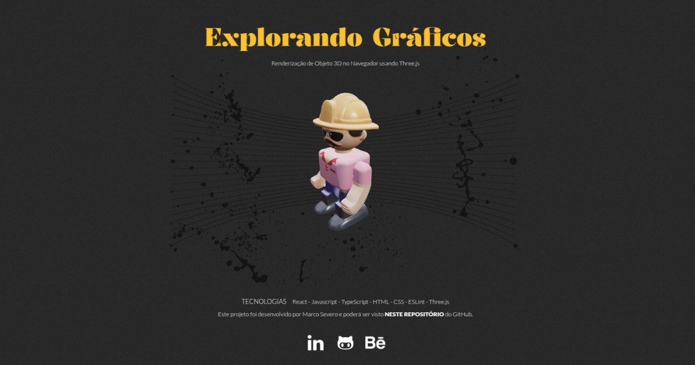

 
Renderização de Objeto 3D no Navegador usando Three.js e React

## Visão Geral

Este projeto utiliza React, Three.js e @react-three/fiber para renderizar um modelo 3D interativo diretamente no navegador.

## Funcionalidades

* Carregamento e exibição de um modelo 3D no formato GLB

* Controle de câmera interativo com OrbitControls

* Iluminação ambiental e direcional

* Indicador de carregamento durante a renderização do modelo

## Modelo 3D

O modelo 3D utilizado nesta aplicação foi gerado utilizando a ferramenta [tripo3d.ai](https://www.tripo3d.ai/).

## Tecnologias

* **Vite**: Ferramenta de build rápida para projetos frontend.
* **React**: Biblioteca para criação de interfaces de usuário.
* **Three.js / React Three Fiber**: Framework para renderização de gráficos 3D no navegador.
* **Drei**: Conjunto de utilitários para facilitar o uso do React Three Fiber.
* **ESLint**: Ferramenta para padronização de código.

## Configuração do Vite para Arquivos ```.glb```

Para que o Vite reconheça arquivos ```.glb```, é necessário adicionar a seguinte configuração ao arquivo ```vite.config.js```:

```js
import { defineConfig } from 'vite';

export default defineConfig({
  assetsInclude: ['**/*.glb'],
});
```
Isso permite que o Vite trate arquivos .glb corretamente no processo de build.
